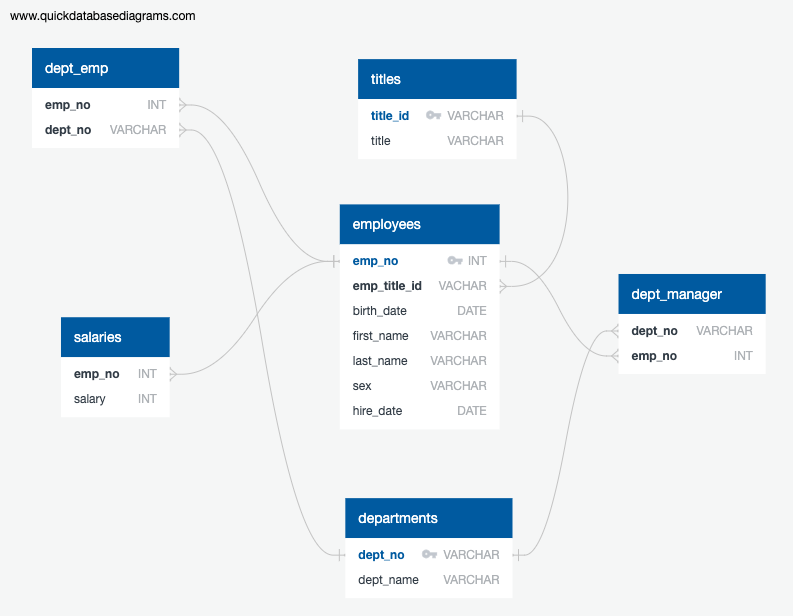

# Employee Database: A Mystery in Two Parts

## Background

In this project, major task is a research project on employees of the corporation from the 1980s and 1990s. All that remain of the database of employees from that period are six CSV files. Designed the tables to hold data in the CSVs, import the CSVs into a SQL database, and answer questions about the data. In other words, will perform as:

1. Data Engineering

2. Data Analysis

#### Data Modeling

Inspected the CSVs and sketched out an ERD of the tables. 

#### Data Engineering

* Used the information and create a table schema for each of the six CSV files. 

  * Specified data types, primary keys, foreign keys, and other constraints.
  * For the primary keys check to see if the column is unique, otherwise create a [composite key](https://en.wikipedia.org/wiki/Compound_key). Which takes to primary keys in order to uniquely identify a row.
  * Created tables in the correct order to handle foreign keys.

* Imported each CSV file into the corresponding SQL table. 

#### Data Analysis

A completed database:

1. Listed  details of each employee: employee number, last name, first name, sex, and salary.

2. Listed first name, last name, and hire date for employees who were hired in 1986.

3. Listed the manager of each department: department number, department name, the manager's employee number, last name, first name.

4. Listed the department of each employee: employee number, last name, first name, and department name.

5. Listed first name, last name, and sex for employees whose first name is "Hercules" and last names begin with "B."

6. Listed all employees in the Sales department, including their employee number, last name, first name, and department name.

7. Listed all employees in the Sales and Development departments, including their employee number, last name, first name, and department name.

8. In descending order, list the frequency count of employee last names.

- - -

## References

Mockaroo, LLC. (2021). Realistic Data Generator. [https://www.mockaroo.com/](https://www.mockaroo.com/)

- - -

© 2021 Trilogy Education Services, LLC, a 2U, Inc. brand. Confidential and Proprietary. All Rights Reserved.
